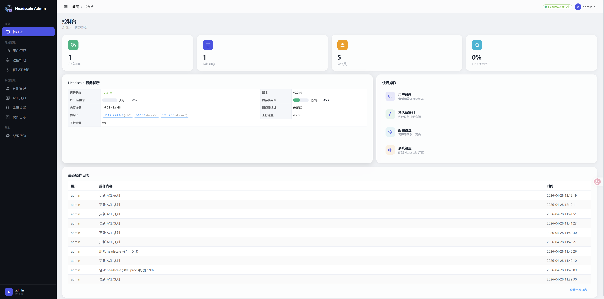
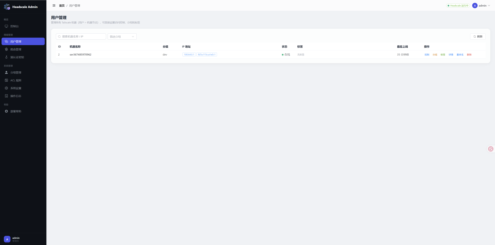
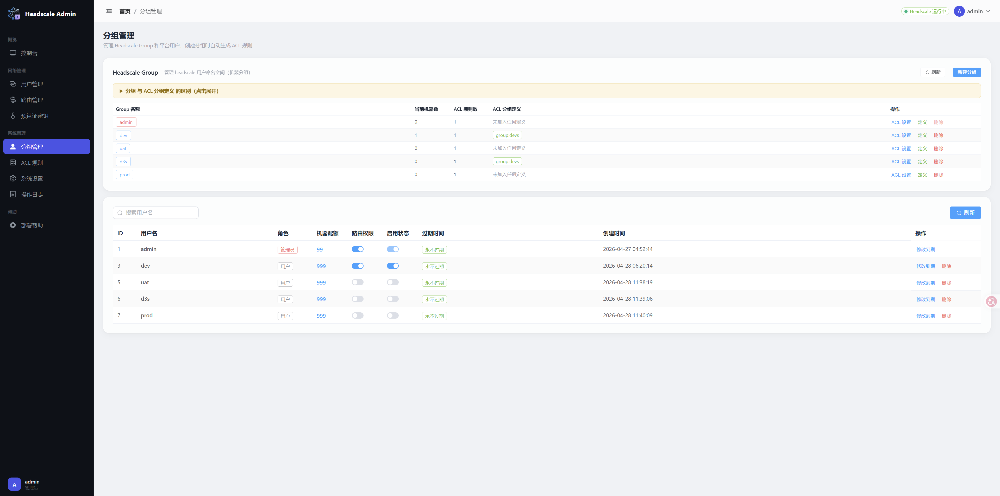
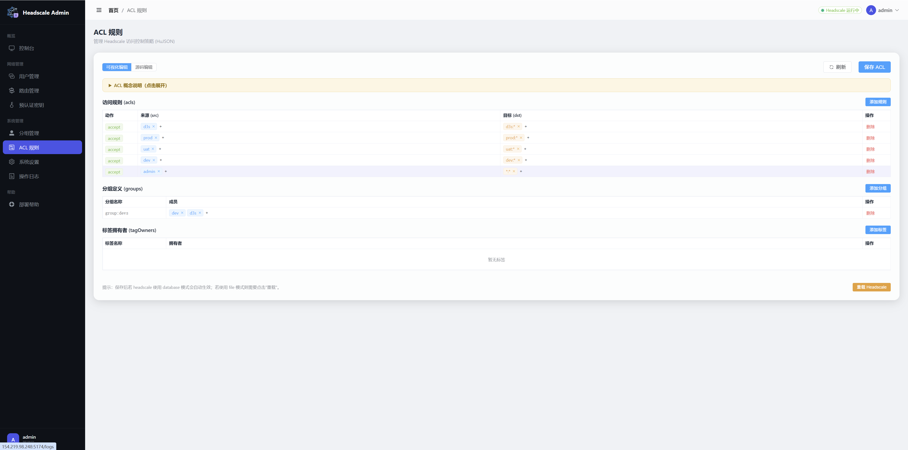
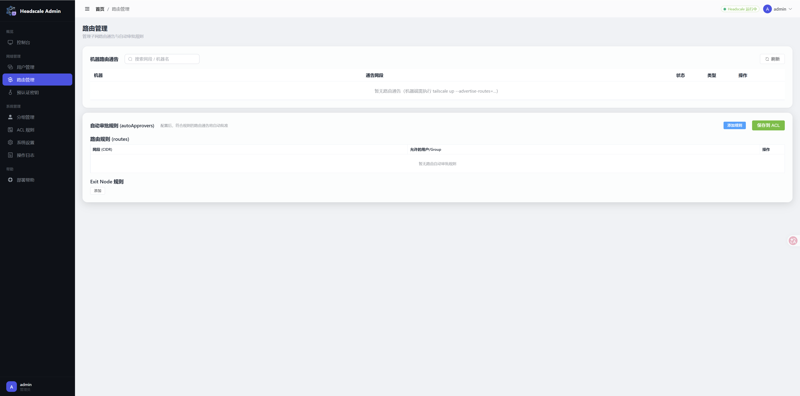
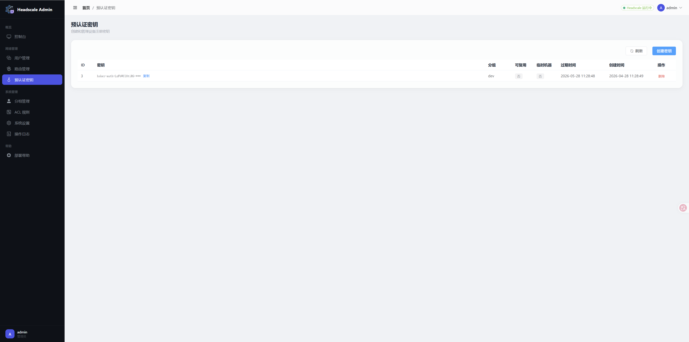

#  ScaleForge

[](https://www.python.org/)
[](https://fastapi.tiangolo.com/)
[](https://vuejs.org/)
[](https://element-plus.org/)
[](#démarrage-rapide-docker-compose)
[](../LICENSE)

> **Un panneau d'administration web entièrement réécrit pour [headscale](https://github.com/juanfont/headscale).**

[English](README_en.md) | [中文](../README.md) | [Deutsch](README_de.md) | [Français](#) | [Русский](README_ru.md)

---

## À propos

**ScaleForge** est une **réécriture complète** de [arounyf/Headscale-Admin-Pro](https://github.com/arounyf/Headscale-Admin-Pro) v4.0.0.

Le projet original était une application monolithique construite avec Flask + Jinja2. Ce projet a été entièrement reconstruit avec une architecture moderne **frontend-backend séparée** : FastAPI fournit l'API REST côté backend, tandis que Vue 3 alimente une SPA côté frontend — le tout enveloppé dans une toute nouvelle interface glassmorphisme sombre.

### Crédits et origine

Ce projet est un fork de [arounyf/Headscale-Admin-Pro](https://github.com/arounyf/Headscale-Admin-Pro) tag 4.0.0. Remerciements particuliers à **arounyf** pour le travail original.

## Stack technique

| Couche | Technologie |
|--------|-------------|
| Backend | Python 3.13 + FastAPI + Uvicorn |
| Frontend | Vue 3 + Vite + Element Plus + Pinia + Vue Router 4 |
| Authentification | JWT + bcrypt natif (compatible Python 3.13 + bcrypt 5.x) |
| Base de données | PostgreSQL 16 (Docker) / SQLite (développement local) |
| Headscale | [Headscale-Admin-AE](https://github.com/chen1749144759/Headscale-Admin-AE) (édition améliorée) |
| Relais DERP | [derper](https://pkg.go.dev/tailscale.com/cmd/derper) autonome avec certificat TLS auto-signé généré automatiquement |

### Architecture

```
                              ┌─────────────────────────────────┐
                              │           Navigateur            │
                              └──────────────┬──────────────────┘
                                             │ :80
                                             ▼
                              ┌─────────────────────────────────┐
                              │   Nginx (SPA + Proxy Inverse)   │
                              │  ┌───────────┬────────────────┐ │
                              │  │ Vue3 SPA  │ /api/* → :5175 │ │
                              │  │  static   │ /hs/*  → :8080 │ │
                              │  └───────────┴────────┬───────┘ │
                              └───────────────────────┼─────────┘
                                        ┌─────────────┤
                                        ▼             ▼
                    ┌──────────────────────┐   ┌───────────────────┐
                    │  FastAPI (port 5175) │   │  Headscale AE     │
                    │   Backend Admin      │   │   (port 8080)     │
                    └─────────┬────────────┘   └────────┬──────────┘
                              │                         │
                              ▼                         ▼
                    ┌──────────────────────────────────────────────┐
                    │        PostgreSQL 16 (base de données        │
                    │              partagée)                       │
                    └──────────────────────────────────────────────┘

    ┌─────────────────────────────────────┐
    │   derper (relais DERP autonome)     │
    │   STUN :3478/udp  DERP :3479/tcp   │
    └─────────────────────────────────────┘
```

## Fonctionnalités

- **Tableau de bord** — Surveillance en temps réel CPU/mémoire/trafic avec courbes de tendance, statistiques des nœuds
- **Gestion des groupes** — Gestion des espaces de noms utilisateurs Headscale, quota de machines, modèles de règles ACL
- **Gestion des nœuds** — Lister, rechercher, filtrer, renommer, supprimer, gestion des tags (forcedTags)
- **Gestion des routes** — Routes de sous-réseau, approuver/révoquer, éditeur autoApprovers, nœuds de sortie
- **Éditeur de règles ACL** — Support HuJSON, formatage, numéros de ligne, synchronisation en mode base de données
- **Gestion des clés pré-autorisées** — Créer/supprimer, copie en un clic
- **Relais DERP** — Serveur DERP autonome privé avec TLS automatique, déploiement zéro configuration
- **Paramètres système** — Configuration de connexion, clé API, politique d'enregistrement, verrouillage de sécurité
- **Journaux d'opération** — Piste d'audit paginée avec noms lisibles
- **Surveillance de l'état** — État de connexion headscale en temps réel dans la barre d'en-tête

## Captures d'écran

| Tableau de bord | Gestion des utilisateurs |
|:---:|:---:|
|  |  |

| Gestion des groupes | Règles ACL |
|:---:|:---:|
|  |  |

| Gestion des routes | Clés pré-autorisées |
|:---:|:---:|
|  |  |

---

## Démarrage rapide (Docker Compose)

Le déploiement le plus simple — une seule commande lance tous les services (PostgreSQL + Headscale AE + Relais DERP + Backend Admin + Nginx).

### Prérequis

- Serveur Linux (Ubuntu 22/24 recommandé)
- Docker + Docker Compose

```bash
# Installer Docker si nécessaire
curl -fsSL https://get.docker.com | sh
```

### Étape 1 : Télécharger

```bash
mkdir -p ~/headscale-admin && cd ~/headscale-admin

# Télécharger docker-compose.yml et les fichiers modèles
for f in docker-compose.yml config.yaml.tmpl derp.yaml.tmpl entrypoint.sh .env.example; do
  curl -fsSL -o "$f" \
    "https://raw.githubusercontent.com/chen1749144759/ScaleForge/main/docker/$f"
done
chmod +x entrypoint.sh
```

### Étape 2 : Configurer .env

```bash
cp .env.example .env
```

Modifiez `.env` et définissez **au minimum** :

```bash
# OBLIGATOIRE — IP publique ou domaine de votre serveur
HEADSCALE_SERVER_URL=http://VOTRE_IP_PUBLIQUE:8080

# OBLIGATOIRE — Adresse publique du relais DERP (généralement identique)
DERP_DOMAIN=VOTRE_IP_PUBLIQUE
```

> **Important** : `HEADSCALE_SERVER_URL` doit être accessible par les clients Tailscale. Si vous modifiez `HS_PORT`, mettez à jour le port de l'URL en conséquence.

### Étape 3 : Lancer

```bash
docker compose up -d
```

Le premier lancement télécharge automatiquement les images, génère les certificats TLS pour DERP et démarre tous les services dans le bon ordre avec des vérifications de santé.

### Étape 4 : Vérifier

```bash
docker compose ps   # Tout doit afficher healthy/Up
```

| Adresse | Usage |
|---------|-------|
| `http://VOTRE_IP` | Panneau d'administration |
| `http://VOTRE_IP:8080` | API Headscale (connexion client) |

### Étape 5 : Créer l'administrateur

Ouvrez `http://VOTRE_IP` dans votre navigateur. **Le premier utilisateur enregistré devient administrateur** (l'inscription se ferme ensuite).

### Ports du pare-feu

| Port | Protocole | Usage |
|------|-----------|-------|
| 80 | TCP | Panneau d'administration web |
| 8080 | TCP | API Headscale + protocole Noise |
| 3478 | UDP | STUN (traversée NAT) |
| 3479 | TCP | Relais DERP (chiffré TLS) |

### Commandes courantes

```bash
# Arrêter tous les services
docker compose down

# Mettre à jour les images et redémarrer
docker compose pull && docker compose up -d

# Voir les journaux
docker compose logs -f --tail=50

# Sauvegarde de la base de données
docker exec hs-postgres pg_dump -U headscale_admin headscale_admin > backup.sql

# Créer manuellement une clé API
docker exec hs-headscale headscale apikey create
```

### Persistance des données

Toutes les données sont persistées via des volumes Docker — `docker compose down` n'entraîne pas de perte de données :

- `postgres-data` — Base de données
- `headscale-data` — Données d'exécution Headscale + Clé API
- `derper-certs` — Certificats TLS du serveur DERP

Pour une réinitialisation complète : `docker compose down -v` (**les données sont irrécupérables**).

---

## Déploiement avancé

Pour le déploiement Docker en conteneur unique, l'installation bare-metal et la référence détaillée des variables d'environnement, consultez le [README chinois](../README.md#方式二docker-单容器部署).

## Configuration du relais DERP

Le serveur de relais DERP autonome est automatiquement configuré lors du déploiement. Pour le mappage de ports personnalisé, le dépannage et le renforcement de la sécurité, consultez :

- [Guide de configuration DERP (Chinois)](derp.md)
- [Guide de configuration DERP (Anglais)](derp_en.md)

## Connexion client

Après le déploiement, installez Tailscale sur vos appareils et pointez vers votre Headscale :

```bash
# Linux
tailscale up --login-server=http://VOTRE_IP_PUBLIQUE:8080

# Windows / macOS
# Définissez le serveur de connexion dans les paramètres du client Tailscale
```

## Projets associés

| Projet | Description |
|--------|-------------|
| [Headscale-Admin-AE](https://github.com/chen1749144759/Headscale-Admin-AE) | Binaire headscale amélioré requis par ce projet |
| [Headscale-Admin-Pro](https://github.com/arounyf/Headscale-Admin-Pro) | Projet original par arounyf |
| [headscale](https://github.com/juanfont/headscale) | Projet headscale officiel |

## Feuille de route

- [x] Déploiement Docker Compose en un clic
- [x] Relais DERP autonome avec TLS automatique
- [x] Graphiques de tendance du trafic en temps réel
- [ ] Basculement mode sombre/clair
- [ ] Support multilingue i18n
- [ ] Intégration OIDC / SSO
- [ ] Optimisation responsive mobile

## Contribuer

Les issues et les Pull Requests sont les bienvenues. Avant de soumettre une PR :

1. Assurez-vous que le frontend se compile sans erreur (`npm run build`)
2. Maintenez la rétrocompatibilité de l'API backend
3. Rédigez des messages de commit clairs décrivant les modifications

## Licence

Ce projet est open source sous la [licence MIT](../LICENSE).
